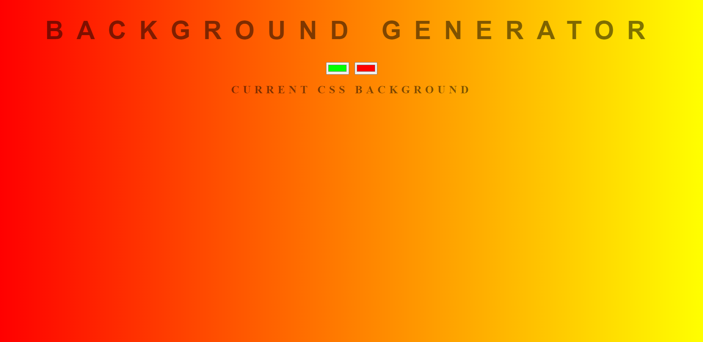

<h1 align="center">
    Background Generator
</h1>

<h1>

</h1>

<h1>

</h1>

# 📋 About

The Background Generator is project that I developed in December 2019 to help people check and decide which background gradient to use. It automatically gives you the line of code to paste in the css file and get the same result on your website!

---

# 💻 Features 

This project was developed with:
- [HTML](https://developer.mozilla.org/en-US/docs/Web/HTML)
- [CSS](https://developer.mozilla.org/en-US/docs/Web/CSS)
- [JavaScript](https://developer.mozilla.org/en-US/docs/Learn/Getting_started_with_the_web/JavaScript_basics)

---

# 📂 Getting started
```bash

# Clone this repository using
$ git clone https://github.com/jpautran/

```
---

<h3 align="center">
Created by João Paulo Autran 🚀
</h3>            